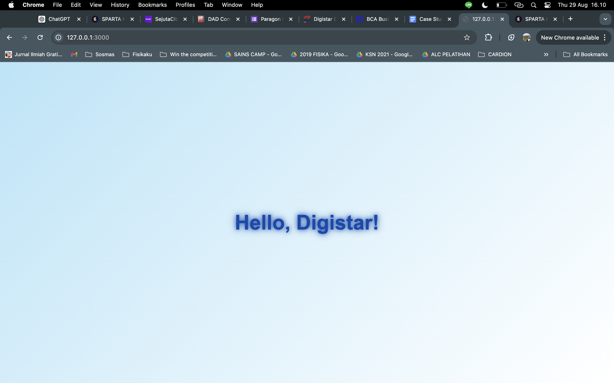
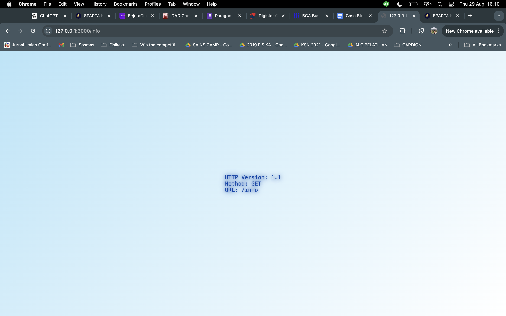
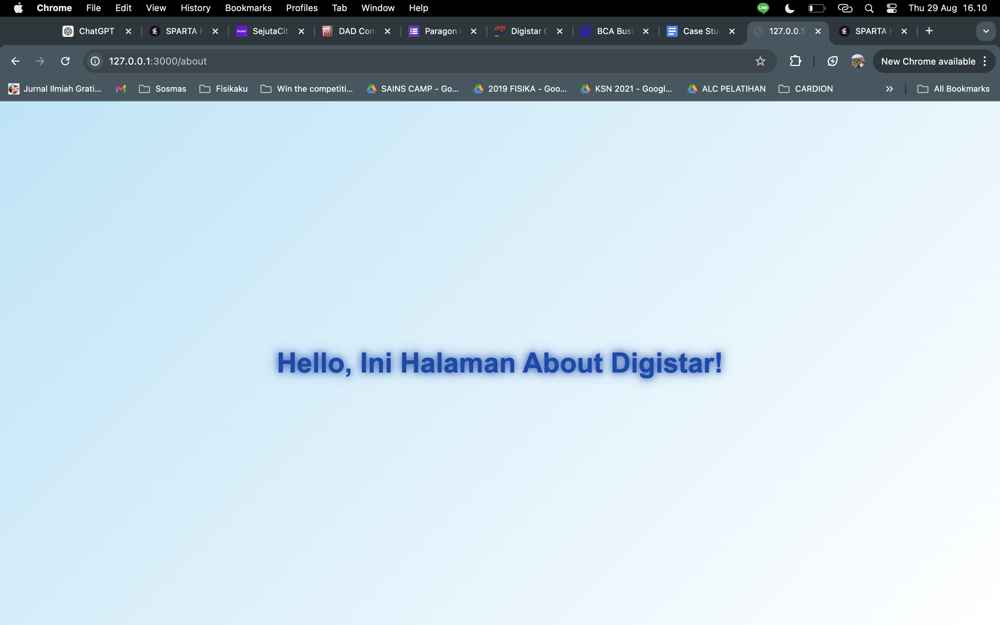
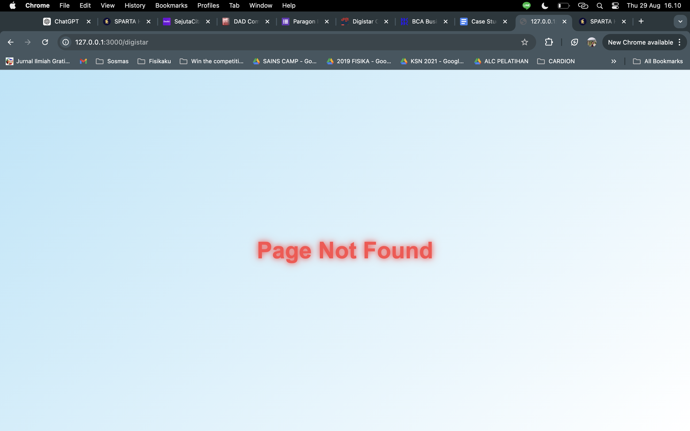
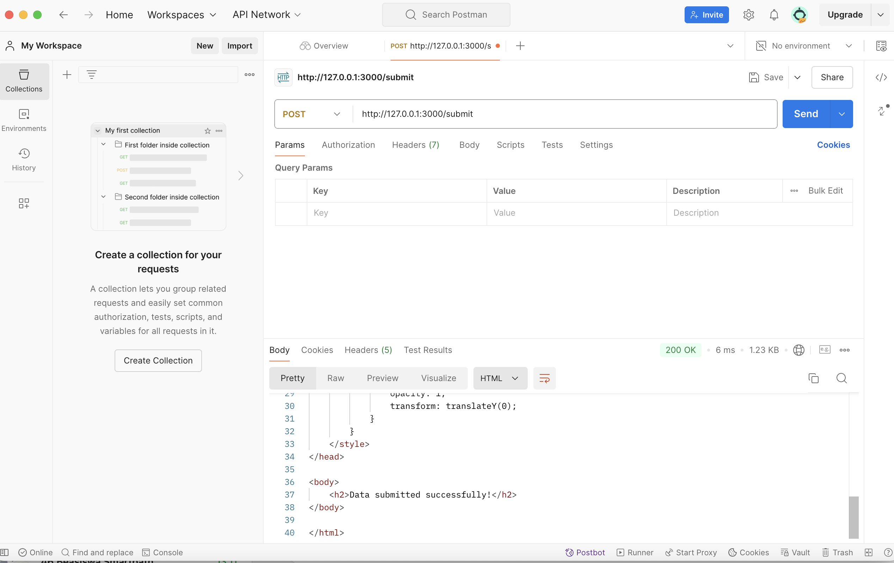
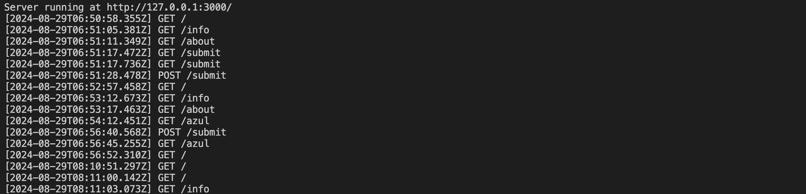

# Digistar-HackerBE-Day2

This project is a simple Node.js HTTP server that demonstrates the use of middleware, custom routing, and rendering HTML with CSS for different pages. The server logs every incoming request using a middleware function and serves custom HTML pages based on the requested URL.

## Features

- **Custom Pages**: The server provides custom HTML pages for the root (`/`), info (`/info`), submit (`/submit`), and about (`/about`) routes.
- **Middleware**: Every incoming request is logged with the HTTP method, URL, and timestamp.
- **Error Handling**: If the requested URL does not match any of the defined routes, a custom 404 page is displayed.
- **Stylish Design**: The pages are styled with a gradient background, text glow effects, and centered content using Flexbox.

## Getting Started

### Prerequisites

- Node.js installed on your machine.

### Installation

1. Clone the repository:
    ```bash
    git clone https://github.com/zultopia/Digistar-HackerBE-Day2.git
    ```

2. Navigate to the project directory:
    ```bash
    cd my-http-server
    ```

3. Install dependencies:
    ```bash
    npm install
    ```

4. Run the server:
    ```bash
    node index.js
    ```

5. Access the server in your browser at `http://127.0.0.1:3000`.

### Routes

- **Home Page (`/`)**: Displays a welcome message.
- **Info Page (`/info`)**: Displays HTTP request information.
- **Submit Page (`/submit`)**: Displays a confirmation message for POST requests.
- **About Page (`/about`)**: Displays an about message.
- **404 Page**: Displays a custom "Page Not Found" message for undefined routes.

### Middleware Logging

The middleware logs each request in the following format:
[ISO Timestamp] HTTP_METHOD /request-url

Example:
[2024-08-29T13:30:00.000Z] GET /

## Screenshots

### 1. Home Page


### 2. Info Page


### 3. About Page


### 4. 404 Page


### 5. Post Submit Page


### 6. Middleware Logging


## Author

**Marzuli Suhada M**